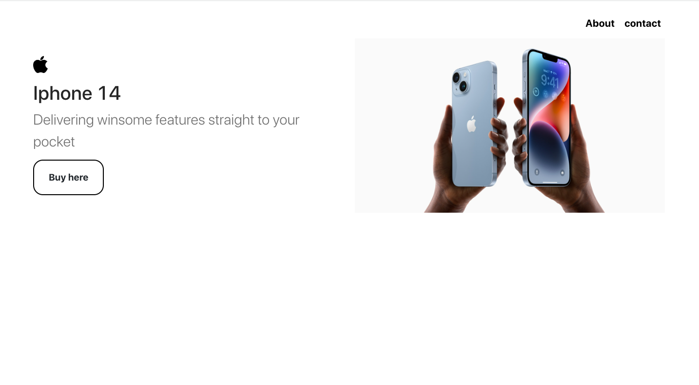

# Basic Routing using React App 

> In this project a layout is created in reactapp by importing `BrowserRouter, Route and Routes` from react-router-dom and a basic routing is applied with About and Contact sections.

> In the contact Section a form from Ant-design library has been imported.

### Layout output
******

